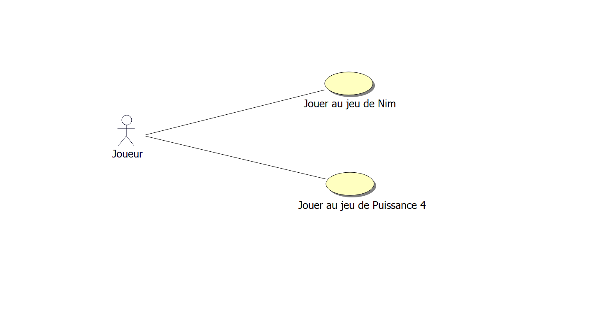
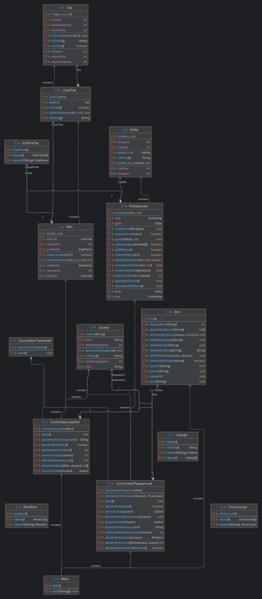

# Rapport de l'itération 3

## Cas d'utilisations

### "Joueur jeu Nim"

**Périmètre :** Système de jeu

**Niveau :** But utilisateur

**Acteur principal :** Les deux joueurs

**Parties prenantes et intérêts :** Les joueurs

**Pré-conditions :** Aucune

**Post-conditions :** Les joueurs ont joué une partie de Nim

**Scénario nominal :**

1. Le système demande aux joueurs à quel jeu ils veulent jouer.
2. Les joueurs saisissent le jeu Nim.
3. Le système demande aux joueurs de saisir un nombre de tas supérieur
   ou égal à 1.
4. Les joueurs saisissent un nombre de tas.
5. Le système demande le nom du joueur 1.
6. Les joueurs saisissent le nom du joueur 1.
7. Le système demande le nom du joueur 2.
8. Les joueurs saisissent le nom du joueur 2.
9. Le système demande aux joueurs d'entrer la contrainte de jeu.
10. Les joueurs saisissent la contrainte de jeu.
11. Le système démarre une partie, le joueur 1 est défini joueur courant
    et commence.
12. Le système affiche l’état de la partie.
13. Le système invite le joueur courant à jouer un coup.
14. Le joueur courant saisit son coup.
15. Le système vérifie l’état de la partie.
16. Le système détermine le vainqueur de la partie et affiche son nom.
17. Le système propose aux joueurs de rejouer.
18. Les joueurs choisissent de ne pas rejouer.
19. Le système affiche le nombre de parties gagnées de chaque joueur.
20. Le système détermine le vainqueur et affiche le nom de celui-ci.

**Extensions :**

- *3.a.* La saisit du nombre de tas est invalide.
    1. Le système affiche l’erreur.
    2. Retour au point 1 du scénario nominal.
- *14.a.* Le coup saisit par le joueur courant est invalide.
    1. Le système affiche l’erreur.
    2. Retour au point 13 du scénario nominal.
- *15.a.* La partie en cours n’est pas terminée.
    1. Le système change le joueur courant.
    2. Retour au point 13 du scénario nominal.
- *16.a.* Les joueurs décident de rejouer une partie.
    1. Retour au point 9 du scénario nominal.
- *17.a.* Les deux joueurs ont le même nombre de victoires.
    1. Le système affiche ex-æquo.

### "Joueur jeu Puissance 4"

**Périmètre :** Système de jeu

**Niveau :** But utilisateur

**Acteur principal :** Les deux joueurs

**Parties prenantes et intérêts :** Les joueurs

**Pré-conditions :** Aucune

**Post-conditions :** Les joueurs ont joué une partie de Puissance 4

**Scénario nominal :**

1. Le système demande aux joueurs à quel jeu ils veulent jouer.
2. Les joueurs saisissent le jeu Puissance 4.
3. Les joueurs saisissent un nombre de tas.
4. Le système demande le nom du joueur 1.
5. Les joueurs saisissent le nom du joueur 1.
6. Le système demande le nom du joueur 2.
7. Les joueurs saisissent le nom du joueur 2.
8. Le système demande aux joueurs s'ils veulent jouer avec les rotations
   de grille.
9. Les joueurs saisissent leur choix.
10. Le système démarre une partie, le joueur 1 est défini joueur courant
    et commence.
11. Le système affiche l’état de la partie.
12. Le système invite le joueur courant à jouer un coup entre jouer et
    rotationner.
13. Le joueur courant saisit son coup.
14. Le système vérifie l’état de la partie.
15. Le système détermine le vainqueur de la partie et affiche son nom.
16. Le système propose aux joueurs de rejouer.
17. Les joueurs choisissent de ne pas rejouer.
18. Le système affiche le nombre de parties gagnées de chaque joueur.
19. Le système détermine le vainqueur et affiche le nom de celui-ci.

**Extensions :**

- *12.a.* Le joueur courant n'a plus de rotation possible.
    1. Le système n'affiche pas la possibilité de rotation.
    2. Retour au point 13 du scénario nominal.
- *13.a.* Le coup saisit par le joueur courant est invalide.
    1. Le système affiche l’erreur.
    2. Retour au point 12 du scénario nominal.
- *13.b.* Le joueur courant choisit de rotationner la grille.
    1. Le système demande dans quel sens le joueur veut rotationner la
       grille.
    2. Le joueur courant saisit son choix.
    3. Le système effectue la rotation de la grille.
    4. Le système décrémente le nombre de rotations restantes du joueur
       courant.
    5. Retour au point 11 du scénario nominal.
- *14.a.* La partie en cours n’est pas terminée.
    1. Le système change le joueur courant.
    2. Retour au point 7 du scénario nominal.
- *15.a.* Le système ne détermine aucun gagnant pour la partie.
    1. Le système affiche que la partie est nulle.
- *16.a.* Les joueurs décident de rejouer une partie.
    1. Retour au point 6 du scénario nominal.
- *19.a.* Les deux joueurs ont le même nombre de victoires.
    1. Le système affiche ex-æquo.

## Modélisation Objet

## Rapport

Pour cette itération, nous avons décidé d'architecturer à nouveau le
code de notre application pour permettre une meilleure modularité et
une meilleure extensibilité.

De ce fait, nous avons alors adopté le principe de séparation des
responsabilités ainsi que le principe de responsabilité unique pour
chaque classe.

Cela implique la création de nouvelles classes pour chaque élément
des jeux, notamment `Tas` et `ListeTas` pour le jeu de Nim, là où avant
les tas étaient une simple `ArrayList<Integer>`.

Ces modifications ont rendu possible la séparation des responsabilités,
ainsi désormais les nouvelles classes possèdent une méthode `toString()`
qui permet d'afficher les éléments de manière lisible.
Cette méthode est appelée par l'IHM pour afficher les éléments du
plateau des jeux.

En effet, la fusion a aussi permis de réduire la duplication de code
dans nos IHM, laissant l'IHM simplement maître des intéractions
utilisateurs de manière unique, aucune fonction spécifique aux jeux
(ces dernières devant résider dans les contrôleurs).

De plus, nous avons décidé de partir sur un paterne d'architecture de
type *Pâtron de méthode* pour unifier nos contrôleurs. Ainsi, ces
derniers doivent respecter un protocole commun de communication, défini
dans la classe abstraite `ControleurTemplate`.

Au niveau des jeux, la modification de leur logique pour rajouter les
nouvelles fonctionnalités demandées a été faite simplement et
rapidement, grâce à nos choix architecturaux fait précédemment.

Enfin, nous avons continué à utiliser l'intelligence artificielle pour
générer de la documentation des méthodes.